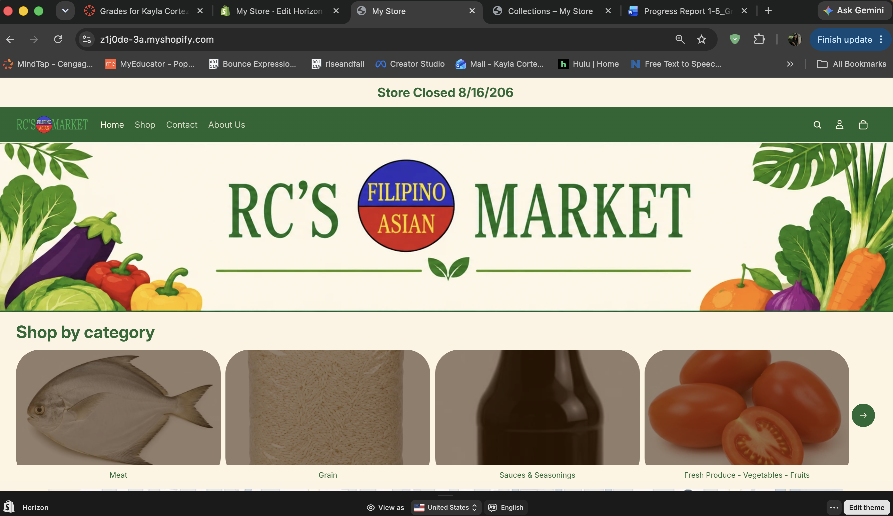
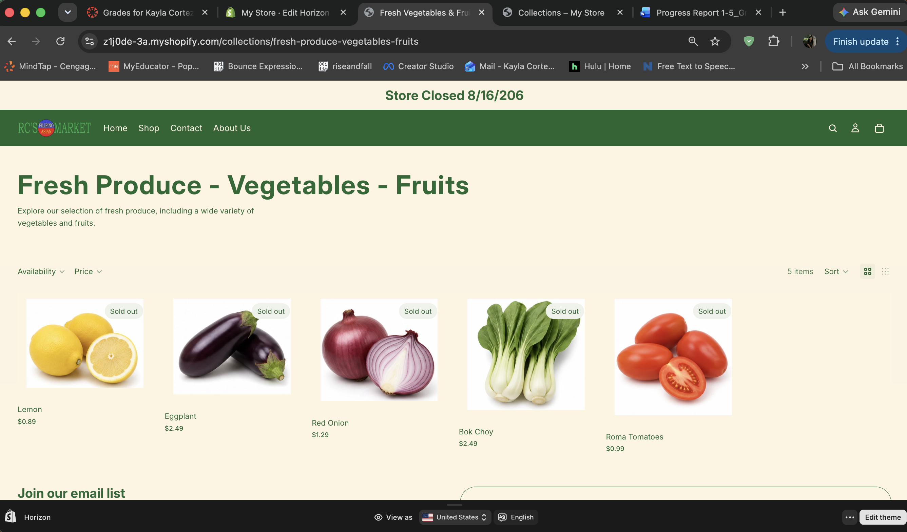
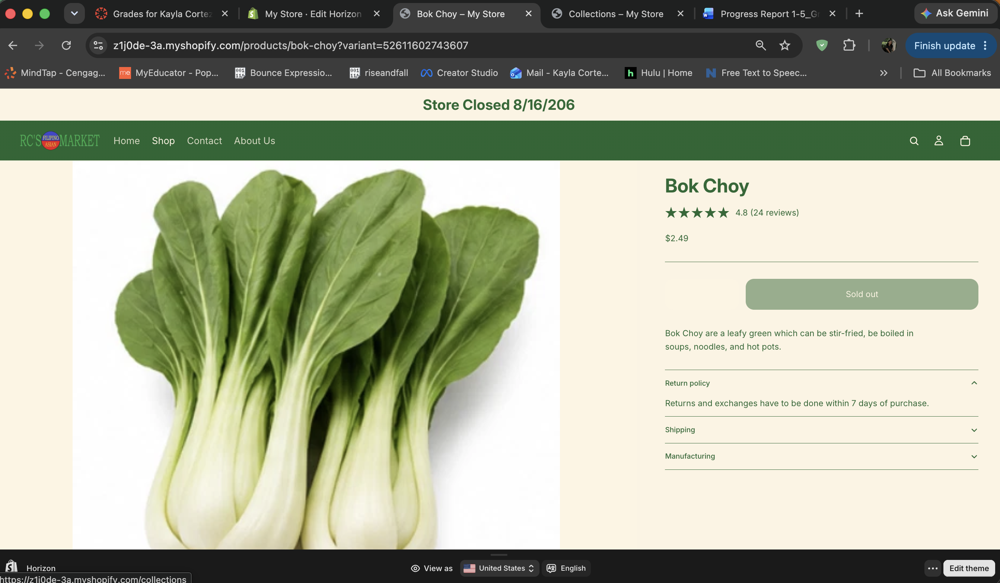
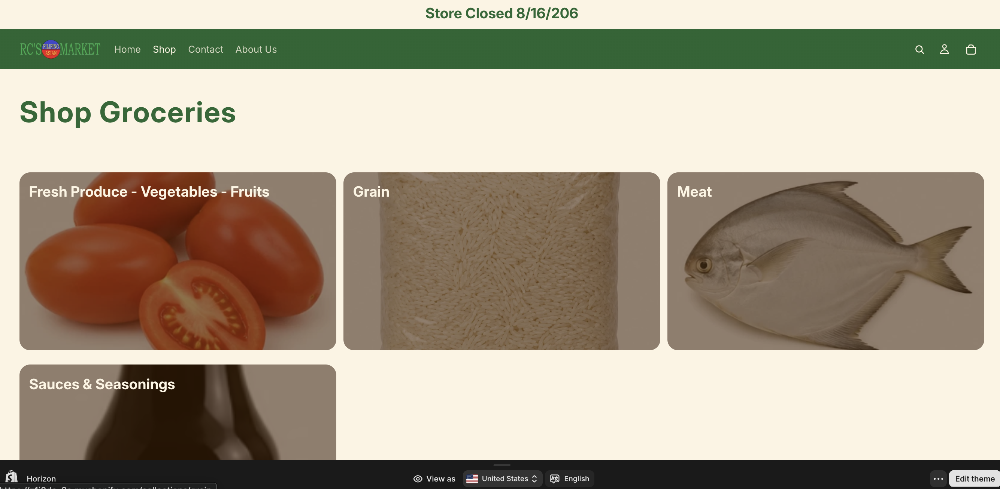
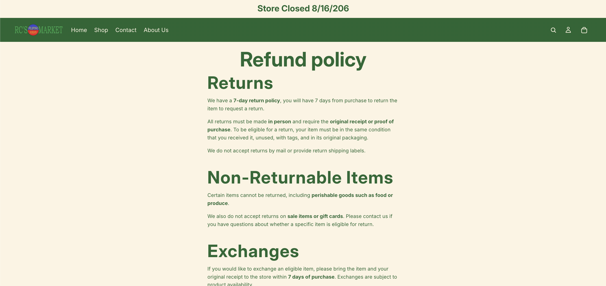
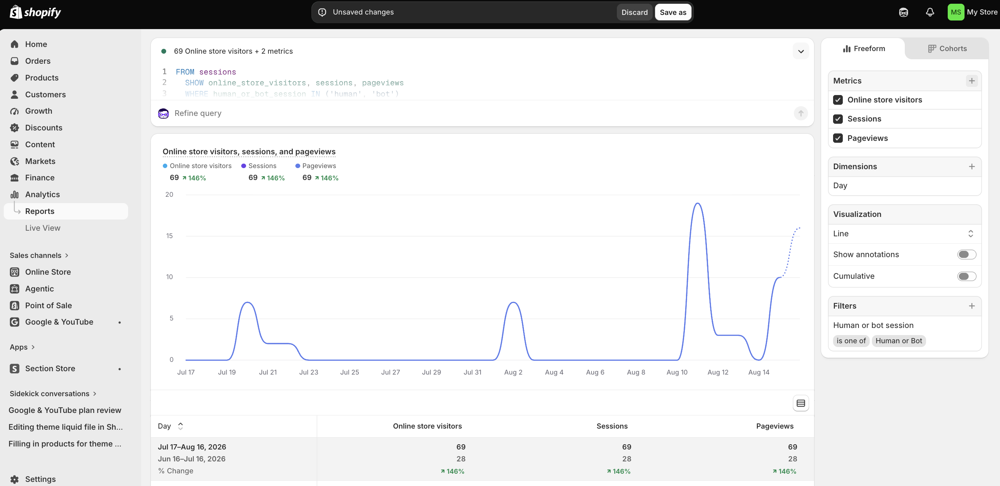

# Store overview
## Briefly describe your store concept, target customer, and product assortment.

# Final store evidence
- Include screenshots of:

1. Homepage

2. Product catalog or product page

3. Collection page

4. Navigation menu

5. Policy/contact information

6. GA4 or Shopify analytics evidence

# Retail technology reflection
Explain what you learned about Shopify as an e-commerce platform.

I learned that the shopify has several e-commerce functions like product management, customer activities, and analytics. Features that I utilized the most throughout this project was, products, collections, and navigation which affect what customers see and how they explore the website.

# Merchandising reflection
Explain what you learned about product catalog management, collections, navigation, or storefront design.

I learned how important it is about product catalog management especially when it comes to Google Shopping Ads. Products need accurate titles, description, prices, images, and inventory.
As for the website, I utilized creating collections which groups similar items together to create categories, so customers that start shopping do not feel overwhelmed. When making the website it also made me consider how customer may navigate and explore the website when it is there first time visiting.

#Analytics reflection
Explain what you learned about GA4, Shopify analytics, or customer behavior tracking.

Before the start of the project, I didn't know that shopify provided analytics. As well as creating SQL automatically depening on what you want to track. For example, currently I am tracking online store visitors, sessions, and pageviews. So far the report shows that there was 69 online store visitors at the moment. Analytics is important to understand when there are changes in website traffic and if customer behavior changes. The current data is limited, however, once more data is collected it can tell us how much they are scrolling on each page, time spent on page, and if they are returning or new vistor.

# CPP Farm Store application
Explain at least three specific ways Shopify, GA4, or e-commerce design principles could support CPP Farm Store.

Some specific ways that shopify, GA4, or e-commerce design princuples could support CPP Farm Store is that the design of a website and organize online products is crucial. This is how users browse through products and explore options online or even before visiting physical store. When designing a website, it is important to keep in mind that you are guiding the visitor to do specific actions. Which is whether clicking on CTAs buttons, explore the website, or even feature special products. This can benefit CPP Farm Store by including clickable banners or banners with buttons highlighting that the provide gift basket customization. When the website is connected to GA4 some metrics to measure is sessions, pageviews, form start, form submission, traffic source, and device type. This can help CPP Farm Store see if they are driving and directing visitors to the form. Along with analyzing any drop offs in the submitting the customization form. This helps if further refinement is needed for the form. By improving the website and in-store experience can create a successful omnichannel journey.

# Final self-assessment
Identify one part of your store that you are proud of and one part you would improve with more time.

I am very proud of the home page because of I was able to reduce the banner sign, include categories, and the Google maps with store location hours. However, there is one thing I want to improve on is when you click shop then goes to shop groceries the images are too large. There are times that shopify is difficult in making freeform edits.

# Appendix

[Clickable Link Github](https://github.com/kaylacortez888/ITP-W11-Shopify-Store---Assignment-9---Final-Shopify-Store-Reflection-Report.git)

[Clickable Link Github Repo](https://github.com/kaylacortez888/ITP-W10-Shopify-Store---Assignment-8---Store-Testing-and-Analytics-Review.git)